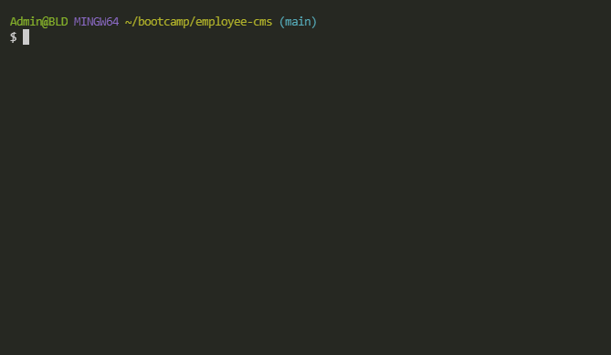

# Employee Manager
Command-line interface for managing (pseudo) employees, managers, and departments in a MySQL database.

---
## Features
- Add departments, roles, employees

- View departments, roles, employees

- Update employee roles

- Update employee managers
---
## Requirements
- [Node/npm](https://docs.npmjs.com/downloading-and-installing-node-js-and-npm)
- [MySQL](https://dev.mysql.com/downloads/mysql/)

---
## Installation

1. Clone the repo or download the code as a zip.   
```
git clone https://github.com/LemonPocky/coding-quiz.git
```
2. If downloaded as zip, unzip the contents. Place the folder in an easily accessible location on your computer.
3. Install MySQL if necessary. Import schema.sql and seed.sql into MySQL to create and populate the database.
```
mysql -u <username> -p employee_cms_db < schema.sql
mysql -u <username> -p employee_cms_db < seed.sql
```
*Note: You do not need to run seed.sql if you have your own data to insert into the database.*

4. While in the root folder, run "npm install".
```
npm install
```
5. Make a copy of ".env.EXAMPLE" and rename it to ".env". Fill out the username and password details.
---
## Usage

Run the program with:
```
node index.js
```
Follow the on-screen prompts.
